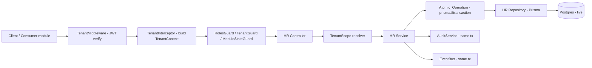
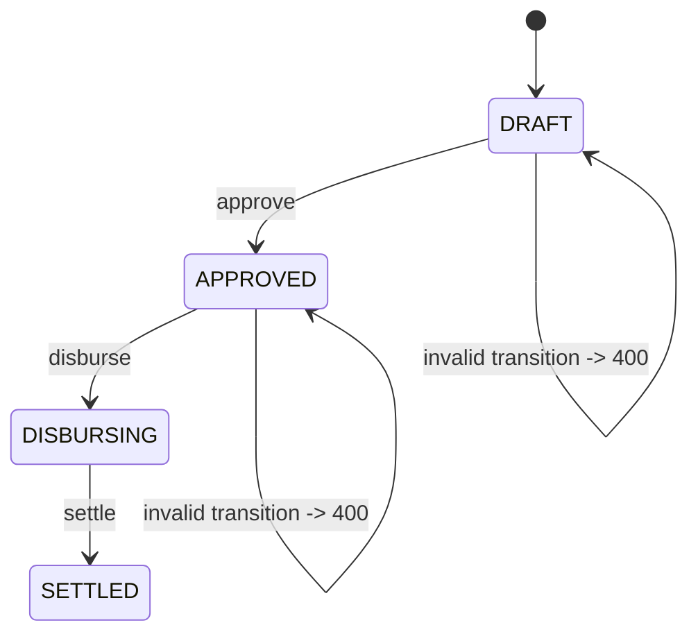

# Design Document

## Overview

This design describes how the HR module is brought to production-grade by systematically
stabilizing every HR flow, fixing recurring bug classes, and completing the missing backends
that other modules depend on. The work is delivered in six independently testable and
deployable phases (Employees → Scheduling → Time & Attendance → Leave → Payroll/Finance →
Recruitment/Performance).

The HR module is a NestJS/TypeScript module rooted at `backend/src/core/hr`, exposed under
the `/hr` route namespace. It is layered as:

- **Controllers** (`hr.controller.ts`, `controllers/*.controller.ts`, `time/*.controller.ts`) —
  HTTP surface, request validation, response shaping.
- **Services** (`hr.service.ts`, `scheduling.service.ts`, `hr-attendance.service.ts`,
  `hr-leave.service.ts`, `hr-payroll.service.ts`, `hr-settlement.service.ts`,
  `hr-recruitment.service.ts`, `time/time.service.ts`, …) — business logic, transactions,
  audit, and domain events.
- **Repository** (`repositories/hr.repository.interface.ts`, `hr.db.repository.ts`,
  `hr.mock.repository.ts`) — data access via Prisma against the live Postgres database.
- **Entities / DTOs** (`entities/*.entity.ts`, `dto/*.dto.ts`) — typed shapes for persistence
  and request payloads.

The investigation of the current code surfaced the concrete bug classes this design targets:

1. **Inconsistent tenant sourcing.** The main `HRController` derives identity from the verified
   `request.tenantContext` (populated by `TenantInterceptor` after the JWT-bearing
   `TenantMiddleware`), but `HrSchedulingController`, `HrAttendanceController`,
   `HrLeaveController`, `HrPayrollController`, `HrRecruitmentController`, and the `time/*`
   controllers read `tenant_id` straight from the `x-tenant-id` header and `user_id` from
   `req.user?.id`. Header-sourced tenant identity is spoofable and violates Requirement 2.3.
2. **Raw `throw new Error(...)` in services.** `SchedulingService.createWorkSchedule` and
   `createWorkShift` throw bare `Error` for ownership/business-rule failures, which surface as
   HTTP 500 instead of 4xx — violating Requirements 1.1 and 1.3 / 7.2 / 7.4.
3. **Field-name drift between DTO, entity, and schema.** Examples: `createWorkShift` reads
   `data.scheduleId` while other code paths use `schedule_id`; entities mix camelCase
   (`PayrollRun.totalGrossPay`) with snake_case schema columns. Mismatches silently drop
   values (Requirement 5).
4. **Hardcoded identifiers.** `HrSettlementService.settlePayrollRun` publishes currency
   `'IDR'` and `disbursePayrollRun` falls back to `'USD'`; `company_id` defaults to `tenant_id`
   in the header-fallback path. These break correctness against the live DB (Requirements 1.2,
   12.2).
5. **Non-atomic multi-write paths.** `approvePayrollRun` performs a status write plus intended
   audit/event emission without a wrapping transaction (Requirement 4).
6. **Duplicate clock-in/out logic** across `hr.controller`, `hr-attendance.controller`, and
   `time/time.controller`, with divergent guards and validation.
7. **Downstream consumers using mock data.** Retail `ShiftControl.tsx` renders
   `MOCK_DRAFT_SHIFTS`, `AVAILABLE_STAFF`, and mocked efficiency/attendance stats because no
   working scheduling backend is wired to it (Requirement 7).

The design does not rewrite the module wholesale. It establishes a small set of shared
correctness primitives (a tenant-scope resolver, an atomic-operation helper, a typed error
surface, and a field-mapping discipline) and applies them phase-by-phase to the endpoints in
each sub-domain, validating every write path against the `tnt-3rlhko` live test tenant.

## Architecture

### Request lifecycle (target state)



The key architectural correction is that **every** HR controller derives identity from the
verified `TenantContext`, never from client-supplied headers or body fields. Controllers that
currently take `@Headers("x-tenant-id")` are migrated to the `@Req() request: RequestWithTenant`
+ `request.tenantContext` pattern already used by `HRController`, and are placed behind the
same `TenantInterceptor`.

### Shared correctness primitives

These are introduced once and reused across all phases.

1. **TenantScope resolver.** A small helper that converts a `TenantContext` into a
   `TenantScope` value object (`{ tenant_id, company_id?, location_id? }`) used to build every
   query `where` clause. Rules it enforces:
   - `tenant_id` is always taken from `TenantContext`.
   - `company_id` and `tenant_id` are treated as distinct; `company_id` is only included when
     it resolves to a real company belonging to `tenant_id` (no `company_id = tenant_id`
     fallback for scoping decisions).
   - `location_id` / `company_id` filters are validated to belong to the caller's `tenant_id`
     before being applied.
   - Privileged roles (`SUPERADMIN`, `OWNER`, `ADMIN`) may widen scope (cross-location /
     cross-company / global) as defined per endpoint; non-privileged roles are forced to their
     context scope.

2. **Atomic_Operation helper.** A thin convention around `prisma.$transaction(async (tx) => …)`
   that ensures any operation performing more than one write — including the audit log and
   domain event emission — runs inside a single transaction and passes `tx` through to the
   repository, `AuditService.log(..., tx)`, and `EventBus.publish(..., tx)`. `SchedulingService`
   already follows this pattern for schedule creation/approval and is the reference template;
   payroll lifecycle methods are brought into line.

3. **Typed error surface.** Business-rule and lookup failures throw NestJS HTTP exceptions
   (`BadRequestException`, `NotFoundException`, `ForbiddenException`, `ConflictException`)
   instead of bare `Error`. A module-scoped exception filter / the existing
   `utils/hr-prisma.errors.ts` maps Prisma errors (e.g. `P2025` not found, `P2003` FK violation,
   `P2002` unique conflict) to the correct 4xx status so that no validation or
   resource-existence failure escapes as a 500.

4. **Field-mapping discipline.** Each create/update path maps DTO fields to schema columns
   through an explicit mapping function (no implicit spread of mismatched-casing objects into
   Prisma). Entities expose schema-aligned column names; compatibility aliases
   (`job_title`, `position_id`) are mapped explicitly rather than persisted blindly.

### Role gating model

`RolesGuard` reads required roles from the `@Roles(...)` decorator and the caller role from
`TenantContext.role`. `SUPERADMIN` is a global bypass; `OWNER` is a tenant-scoped bypass
(blocked from system routes); `ADMIN`/`MANAGER`/`MEMBER` must match the declared role set.
Every mutating HR endpoint (create/update/delete/transition) must carry a `@Roles(...)`
declaration; this design audits each controller method and adds gates where missing
(Requirement 3.4).

### Phasing

| Phase | Sub-domain | Primary controllers/services | Key tables |
|-------|-----------|------------------------------|------------|
| 1 | Employees / Roster | `HRController` (employees/*), `hr.service` | `employees`, `departments` |
| 2 | Scheduling | `HrSchedulingController`, `scheduling.service` | `work_schedules`, `work_shifts`, `locations` |
| 3 | Time & Attendance | `HrAttendanceController`, `time/*`, `hr-attendance.service`, `time.service` | `attendance` |
| 4 | Leave | `HrLeaveController`, `hr-leave.service` | `leave_requests` |
| 5 | Payroll & Finance | `HrPayrollController`, `hr-payroll.service`, `hr-settlement.service` | `payroll_runs`, `payroll_lines`, `finance_journal_entries` |
| 6 | Recruitment / Performance | `HrRecruitmentController`, `hr-recruitment.service` | `requisitions`, `candidates`, `performance_cycles`, `performance_reviews` |

Each phase is self-contained at the controller/service/repository slice level, ships via the
existing git-push-to-`main` + Docker rebuild pipeline, and is verified against `tnt-3rlhko`
before being considered complete (Requirement 13).

## Components and Interfaces

### TenantScope resolver

```typescript
interface TenantScope {
  tenant_id: string;
  company_id?: string;
  location_id?: string;
}

// Resolves the effective, validated scope for a request.
// Throws ForbiddenException if a requested company/location does not belong to tenant_id.
function resolveScope(
  ctx: TenantContext,
  requested?: { location_id?: string; company_id?: string },
): Promise<TenantScope>;
```

- Non-privileged callers: `location_id`/`company_id` forced to context values.
- Privileged callers: requested filters honored, but still validated to belong to `tenant_id`.

### Controller contract (target, all HR controllers)

```typescript
@Controller('hr/scheduling')
@UseInterceptors(TenantInterceptor)
@UseGuards(ModuleStateGuard, TenantGuard, RolesGuard)
export class HrSchedulingController {
  @Post('schedules')
  @Roles(UserRole.ADMIN, UserRole.MANAGER)
  async createSchedule(
    @Req() request: RequestWithTenant,
    @Body() dto: CreateWorkScheduleDto,
  ) {
    const scope = await this.scope.resolve(request.tenantContext, { location_id: dto.location_id });
    return this.schedulingService.createWorkSchedule(scope, dto, request.tenantContext.user_id);
  }
}
```

Migration changes per controller:
- Replace `@Headers("x-tenant-id") tenant_id` with `@Req() request: RequestWithTenant`.
- Source `user_id` from `request.tenantContext.user_id` (the verified actor), not `req.user?.id`
  alone.
- Pass a resolved `TenantScope` (or `tenant_id`) into services instead of a raw header string.

### Scheduling service (Phase 2 reference)

```typescript
createWorkSchedule(scope, dto, user_id): Promise<WorkSchedule>   // validates location ownership -> 400 if foreign
createWorkShift(scope, dto, user_id): Promise<WorkShift>         // rejects add-to-APPROVED -> 400/409
updateWorkSchedule(scope, id, dto, user_id): Promise<WorkSchedule>
updateWorkShift(scope, id, dto, user_id): Promise<WorkShift>
approveSchedule(scope, id, user_id): Promise<WorkSchedule>       // atomic status transition + events
getWorkSchedules(scope, filter): Promise<WorkSchedule[]>
getWorkShifts(scope, filter): Promise<WorkShift[]>
```

Fixes: `new Error(...)` → `BadRequestException`/`ConflictException`; `data.scheduleId` →
`schedule_id` aligned with schema; ownership check returns 400 not 500.

### Shift scheduling consumer contract (Retail `ShiftControl`)

The backend must return shapes the Retail page can consume directly, replacing
`MOCK_DRAFT_SHIFTS` and `AVAILABLE_STAFF`:

```typescript
// GET /hr/scheduling/shifts  -> ScheduledShift[]
interface ScheduledShift {
  id: string;
  employeeId: string;   // mapped from employee_id
  name: string;         // employee full_name
  role: string;         // employee role_title / position
  startTime: string;    // "HH:mm"
  endTime: string;      // "HH:mm"
  dayOfWeek: number;    // 0-6
  status: 'draft' | 'published';
}

// GET /hr/employees (scoped) -> AvailableStaff[]
interface AvailableStaff { id: string; name: string; role: string; }
```

### Payroll lifecycle (Phase 5)

```typescript
calculatePayroll(scope, employee_id, period, user_id): Promise<Payroll>
approvePayrollRun(scope, runId, user_id): Promise<PayrollRun>    // DRAFT -> APPROVED (atomic)
disbursePayrollRun(scope, runId, user_id): Promise<PayrollRun>   // APPROVED -> DISBURSING (atomic, + journal)
settlePayrollRun(scope, runId, user_id): Promise<PayrollRun>     // DISBURSING -> SETTLED (atomic, + finance records, + event)
```

State machine:



Fixes: resolve currency from the company record rather than hardcoded `'IDR'`/`'USD'`; wrap
`approvePayrollRun` in `$transaction`; include the Finance journal/event inside the settle
transaction.

### Repository

The `IHRRepository` interface already threads an optional `tx?: Prisma.TransactionClient`
through every write method. The design requires that:
- Every read method filters by `tenant_id` (and scope) in its `where` clause.
- Composite-key reads use `findFirst({ where: { id, tenant_id } })` rather than
  `findUnique({ where: { id } })`, satisfying Requirement 4.3 and preventing cross-tenant reads.

## Data Models

Existing entities are retained; the design aligns their field names with schema columns and
clarifies scope columns. Representative models:

### Employee (`employees`)
`id, tenant_id, location_id?, company_id?, employee_code, first_name, last_name, full_name,
email, phone?, department_id, manager_id?, position, position_id?, role_title, status,
employment_type, base_salary?, hourly_rate?, hire_date, termination_date?, created_at,
updated_at`. Soft-deactivation via `status = 'terminated'`/inactive (record retained).

### Work_Schedule (`work_schedules`) / Work_Shift (`work_shifts`)
- `WorkSchedule { id, tenant_id, location_id, name, status: 'DRAFT'|'APPROVED'|'PUBLISHED',
  approved_by?, approved_at?, created_at, updated_at }`
- `WorkShift { id, tenant_id, schedule_id, employee_id, location_id?, start_time, end_time,
  day_of_week, status, created_at, updated_at }`
- Invariant: a `WorkShift.schedule_id` references a `WorkSchedule` in the same `tenant_id`;
  shifts cannot be added to an `APPROVED` schedule.

### Attendance (`attendance`)
`id, tenant_id, employee_id, location_id, date, check_in_time?, check_out_time?, status,
source?, device_id?, shift_id?, work_duration_minutes, created_at, updated_at, deleted_at?`.
Invariant: at most one **open** record (no `check_out_time`) per employee at a time.

### Leave_Request (`leave_requests`)
`id, tenant_id, employee_id, leave_type, start_date, end_date, total_days, reason,
status: 'pending'|'approved'|'rejected'|'cancelled', requested_at, reviewed_by?, reviewed_at?,
review_notes?, created_at, updated_at`. Transitions only valid from `pending`.

### Payroll_Run (`payroll_runs`) / Payroll_Line (`payroll_lines`)
`PayrollRun { id, tenant_id, period_start, period_end, status:
'DRAFT'|'APPROVED'|'DISBURSING'|'SETTLED', total_gross_pay, total_net_pay, base_currency,
created_at, updated_at }`. The settle transition produces Finance integration records
(`finance_journal_entries` + lines) in the same transaction.

### Recruitment / Performance
`Requisition`, `Candidate`, `Interview`, `PerformanceCycle`, `PerformanceReview` — all carry
`tenant_id`; hiring a candidate creates an `Employee` within the same `tenant_id` atomically.

All date values are serialized to ISO 8601 in responses (Requirement 1.5).

## Correctness Properties

*A property is a characteristic or behavior that should hold true across all valid executions
of a system — essentially, a formal statement about what the system should do. Properties
serve as the bridge between human-readable specifications and machine-verifiable correctness
guarantees.*

The HR module is well suited to property-based testing: tenant isolation, role gating,
transactional integrity, and field-name fidelity are universal rules that must hold across a
large space of records, scopes, roles, and operations. The acceptance criteria collapse into a
small set of cross-cutting properties, each parameterized across the six phases and the HR
record types (employee, work schedule/shift, attendance, leave request, payroll run,
requisition/candidate/cycle/review). Property tests use the live test tenant (`tnt-3rlhko`)
plus an isolated secondary tenant for cross-tenant assertions, and use fault injection
(mockable repository/transaction boundaries) for atomicity.

### Property 1: Tenant-scoped reads never leak other tenants

*For any* two distinct tenants seeded with HR records, and any read (list, filtered list, or
get-by-id) issued by a non-privileged caller of one tenant, every returned record belongs to
that caller's `tenant_id` and permitted scope, and a get-by-id for a record owned by the other
tenant returns a not-found response.

**Validates: Requirements 2.1, 2.6, 4.3, 6.1, 6.2, 6.7, 7.7, 8.5, 9.5, 10.6, 11.4, 11.5**

### Property 2: Effective scope derives from verified context, not client input

*For any* create request whose body or headers supply a `tenant_id` or `company_id` differing
from the caller's verified `TenantContext`, the persisted record uses the context values; the
resolved `company_id` is never silently set equal to `tenant_id` when a real company exists;
and any requested `location_id` or `company_id` that does not belong to the caller's
`tenant_id` is rejected with a client-error response.

**Validates: Requirements 2.2, 2.3, 2.4, 2.5, 7.2**

### Property 3: Mutating endpoints enforce their Role_Gate

*For any* mutating HR endpoint and any caller role, the request is rejected with a forbidden
(403) response when the role is neither included in the endpoint's `@Roles` gate nor a
permitted privileged bypass (SUPERADMIN global, OWNER tenant-scoped), and permitted otherwise;
and every create/update/delete/transition handler in the HR controllers declares a `@Roles`
gate.

**Validates: Requirements 3.1, 3.2, 3.3, 3.4**

### Property 4: Round-trip persistence of created and updated records

*For any* valid create or update of any HR record type, reading the record back within the
same Tenant_Scope yields a record whose persisted fields equal the values supplied on the
operation (including correct DTO-to-column mapping with no name/casing drops), whose
`tenant_id` equals the caller's context, and whose date fields are serialized in ISO 8601
format.

**Validates: Requirements 1.5, 5.1, 5.2, 5.3, 6.3, 6.4, 7.1, 7.3, 8.1, 9.1, 10.1, 11.1, 11.3, 12.4**

### Property 5: Multi-write operations are atomic

*For any* HR operation that performs more than one database write (e.g. schedule
create/approve, payroll approve/disburse/settle, candidate hire), injecting a failure at any
write point leaves the database unchanged — no record, audit log, or domain event from that
operation persists.

**Validates: Requirements 4.1, 4.2, 4.4, 7.5, 7.6, 10.2, 10.3, 10.4, 11.2**

### Property 6: Lifecycle transitions succeed only from valid states

*For any* stateful HR entity (leave request, payroll run, work schedule, attendance) and any
requested transition, the transition succeeds and persists the new state (recording the actor
from context where applicable, e.g. leave approver/rejection note) if and only if it is a valid
edge from the entity's current state; otherwise it is rejected with a client-error response and
the state is unchanged.

**Validates: Requirements 7.4, 8.2, 8.3, 8.4, 9.2, 9.3, 9.4, 10.5**

### Property 7: At most one open attendance record per employee

*For any* sequence of clock-in / clock-out operations for an employee within a Tenant_Scope,
the employee never has more than one open (un-clocked-out) attendance record at any time.

**Validates: Requirements 8.1, 8.2, 8.3, 8.4**

### Property 8: Valid requests never produce server errors

*For any* valid, scoped request to any HR endpoint, the response status is below 500; inputs
that fail validation produce a 400–422 response and missing in-scope resources produce a 404,
never a 500.

**Validates: Requirements 1.1, 1.3, 1.4, 1.6, 6.6, 7.8**

### Property 9: Consumer-contract conformance for staff and schedule projections

*For any* set of persisted employees, work schedules, and work shifts within a Tenant_Scope,
the scheduling and roster endpoints return collections that conform to the `ScheduledShift[]`
and `AvailableStaff[]` contracts consumed by the Retail `ShiftControl` page (required fields
present, correct field names and value formats).

**Validates: Requirements 1.6, 6.6, 7.8**

## Error Handling

The module standardizes error handling so that no validation, lookup, or business-rule failure
escapes as an HTTP 500 (Requirement 1.1, 1.3, 1.4).

- **Validation errors.** DTOs use `class-validator`; the global `ValidationPipe` returns 400
  for malformed payloads with descriptive messages.
- **Business-rule violations.** Services throw typed NestJS exceptions instead of bare `Error`:
  - Foreign location/company on create → `BadRequestException` (currently `new Error` → 500 in
    `SchedulingService.createWorkSchedule`).
  - Adding a shift to an `APPROVED` schedule → `ConflictException` (409) /
    `BadRequestException` (400).
  - Invalid lifecycle transition (leave/payroll/attendance) → `BadRequestException` with the
    current and attempted state in the message.
  - Double clock-in / clock-out with no open record → `BadRequestException`.
- **Resource lookups.** Composite-key reads (`findFirst({ where: { id, tenant_id } })`) return
  `null` → controller maps to `NotFoundException` (404). Cross-tenant ids therefore surface as
  404, not as leakage.
- **Authorization.** `RolesGuard` throws `ForbiddenException` (403) for role failures;
  `TenantGuard`/`TenantInterceptor` reject requests without a verified context.
- **Prisma errors.** A mapping layer (`utils/hr-prisma.errors.ts`) translates known Prisma error
  codes to HTTP status: `P2025` → 404, `P2002` → 409, `P2003`/`P2000` → 400. Unmapped errors are
  logged and returned as 500 only as a last resort.
- **Transactions.** Any exception thrown inside a `prisma.$transaction` callback rolls back the
  whole operation (Property 5), including audit logs and events written with the same `tx`.
- **Hardcoded-identifier removal.** Currency, company, and account resolution read from the
  tenant's company/finance records; failures (e.g. no open fiscal period, missing accounts)
  raise descriptive `BadRequestException`s rather than proceeding with hardcoded values.

## Testing Strategy

The module uses a dual approach: property-based tests for the universal correctness properties
above, and example/integration tests for concrete scenarios, edge cases, and live-DB wiring.

### Property-based tests

- **Library:** `fast-check` with Jest (the backend's existing TypeScript/Jest toolchain). The
  team MUST NOT hand-roll property generation.
- **Iterations:** each property test runs a minimum of 100 generated cases.
- **Tagging:** each property test is tagged with a comment referencing its design property, in
  the format: `// Feature: hr-module-stabilization, Property {number}: {property_text}`.
- **One test per property:** each of Properties 1–9 is implemented by a single property-based
  test, parameterized across the relevant phases/record types.
- **Generators:** custom arbitraries for `TenantContext` (varied tenant/company/location/role),
  HR DTOs (valid and adversarial/spoofed payloads), role sets, and lifecycle states.
- **Isolation & atomicity:** cross-tenant properties seed two tenants; atomicity (Property 5)
  uses a mockable transaction/repository boundary to inject failures at each write point and
  assert no partial persistence.
- **Live verification:** read/round-trip properties execute against the live database using the
  `tnt-3rlhko` test tenant per phase, satisfying Requirements 12.1 and 12.4.

### Example and edge-case unit tests

Focused, concrete tests complement the properties (kept minimal — properties cover the broad
input space):
- Foreign-location schedule create returns 400 (regression for the `new Error` → 500 bug).
- Add shift to approved schedule returns 409/400.
- Double clock-in returns 400; clock-out with no open record returns 400.
- Each payroll transition: valid edge succeeds, invalid edge returns 400.
- Field-mapping regressions: `schedule_id` vs `scheduleId`, `total_gross_pay` vs
  `totalGrossPay` map correctly.

### Integration / smoke tests (per phase, against `tnt-3rlhko`)

- Each phase's write paths are exercised against the real database; a verification run that
  surfaces a missing column, invalid FK, or hardcoded identifier blocks phase completion
  (Requirements 12.1, 12.2, 13.4).
- Finance integration: a settled payroll run produces balanced `finance_journal_entries`
  lines (debit = credit) in the same transaction (Requirement 10.4).
- Consumer wiring: Retail `ShiftControl` loads real schedules/shifts/staff with
  `MOCK_DRAFT_SHIFTS` / `AVAILABLE_STAFF` removed (Requirement 7.8).

### Per-phase completion gate

A phase is complete only when, for the endpoints in its sub-domain: Properties 1–9 (as
applicable) pass, the example/edge tests pass, and the live `tnt-3rlhko` verification run is
clean — satisfying Requirements 1–5 for that phase (Requirement 13.4).
