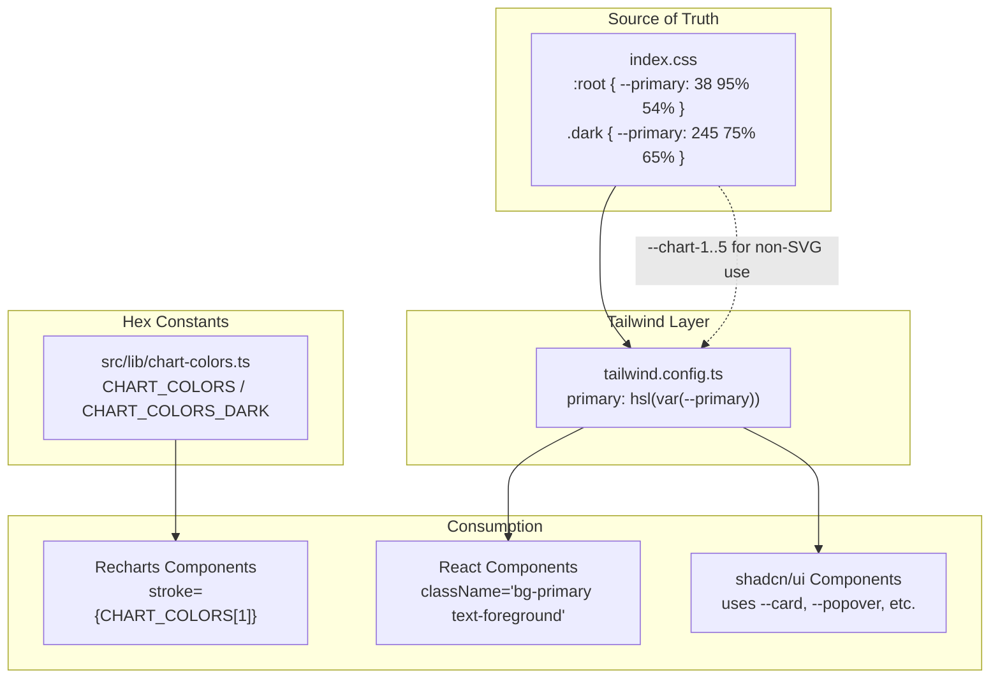
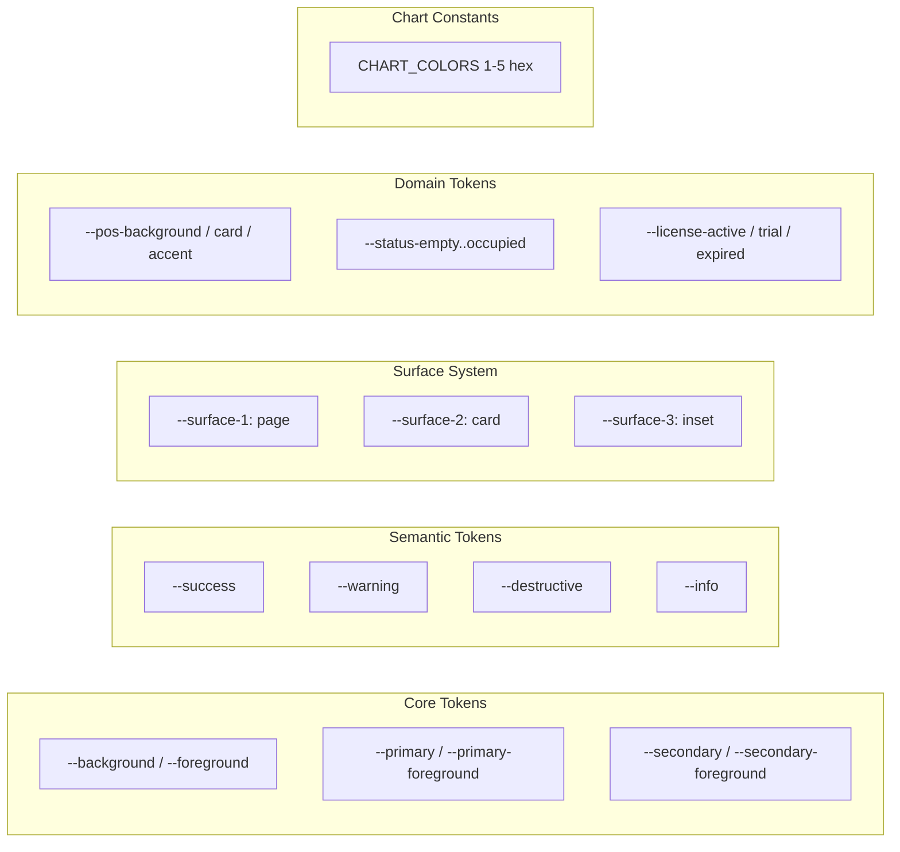

# Design Document: UI Color System Redesign

## Overview

This design defines the complete color architecture for the Zenvix Business Flow Suite v2, replacing the broken state left by a mechanical find-and-replace operation. The system is built on three layers:

1. **CSS Custom Properties** (`src/index.css`) — the single source of truth for all color values in bare HSL triplet format
2. **Tailwind Configuration** (`tailwind.config.ts`) — maps CSS variables to utility classes via `hsl(var(--token))` expressions
3. **Hardcoded Hex Constants** (`src/lib/chart-colors.ts`) — provides literal color values for Recharts SVG rendering, which operates outside the CSS cascade

The design addresses three defect categories:
- **Double-opacity classes** (e.g., `bg-secondary/5/50`) — malformed Tailwind classes that generate no CSS
- **Undefined CSS variables** (e.g., `--pos-background` previously missing) — tokens referenced by components but never declared
- **Recharts CSS variable leakage** — SVG props receiving `hsl(var(--primary))` strings that Recharts cannot resolve

### Design Principles

- **Single source of truth**: All color values live in `index.css` `:root` and `.dark` blocks
- **Semantic over raw**: Components reference intent-based tokens (`--primary`, `--success`) not palette values (`blue-600`)
- **Recharts isolation**: Chart components use hex constants exclusively; CSS variables are reserved for DOM-rendered elements
- **No overrides of Tailwind built-ins**: `white` and `slate` remain at their default Tailwind definitions

## Architecture



### Token Taxonomy



## Components and Interfaces

### 1. CSS Variable Layer (`src/index.css`)

**Responsibility**: Declares all color tokens as bare HSL triplets in `:root` (light) and `.dark` blocks.

**Interface contract**:
- Every variable uses the format `--name: H S% L%` (no `hsl()` wrapper)
- Tailwind consumes these as `hsl(var(--name))` or `hsl(var(--name) / opacity)`
- Both `:root` and `.dark` must declare the same set of variable names

**Variable groups**:
| Group | Variables | Count |
|-------|-----------|-------|
| Core | background, foreground | 2 |
| Primary/Secondary | primary, primary-foreground, secondary, secondary-foreground | 4 |
| Surfaces | surface-1, surface-2, surface-3, card, card-foreground, popover, popover-foreground | 7 |
| Semantic | success, warning, destructive, info (each + foreground) | 8 |
| Muted/Accent | muted, muted-foreground, accent, accent-foreground | 4 |
| Borders | border, input, ring | 3 |
| Sidebar | sidebar-background, sidebar-foreground, sidebar-primary, sidebar-primary-foreground, sidebar-accent, sidebar-accent-foreground, sidebar-border, sidebar-ring | 8 |
| POS | pos-background, pos-card, pos-accent | 3 |
| FNB Status | status-empty, status-ordering, status-served, status-billed, status-occupied | 5 |
| License | license-active, license-trial, license-expired | 3 |
| Chart | chart-1, chart-2, chart-3, chart-4, chart-5 | 5 |
| **Total** | | **52 variables × 2 modes = 104 declarations** |

### 2. Tailwind Configuration (`tailwind.config.ts`)

**Responsibility**: Maps CSS variables to Tailwind utility classes. Does NOT define color values directly.

**Interface contract**:
- All color entries in `extend.colors` use `hsl(var(--token-name))` format
- No `white` override (must resolve to Tailwind's built-in `#ffffff`)
- No `slate` override (must resolve to Tailwind's built-in slate palette)
- Domain tokens nested: `pos.background`, `status.empty`, `license.active`, etc.

**Structure**:
```typescript
extend: {
  colors: {
    // shadcn core (flat)
    border: "hsl(var(--border))",
    input: "hsl(var(--input))",
    ring: "hsl(var(--ring))",
    background: "hsl(var(--background))",
    foreground: "hsl(var(--foreground))",
    // shadcn nested
    primary: { DEFAULT: "hsl(var(--primary))", foreground: "hsl(var(--primary-foreground))" },
    secondary: { DEFAULT: "hsl(var(--secondary))", foreground: "hsl(var(--secondary-foreground))" },
    destructive: { DEFAULT: "hsl(var(--destructive))", foreground: "hsl(var(--destructive-foreground))" },
    muted: { DEFAULT: "hsl(var(--muted))", foreground: "hsl(var(--muted-foreground))" },
    accent: { DEFAULT: "hsl(var(--accent))", foreground: "hsl(var(--accent-foreground))" },
    popover: { DEFAULT: "hsl(var(--popover))", foreground: "hsl(var(--popover-foreground))" },
    card: { DEFAULT: "hsl(var(--card))", foreground: "hsl(var(--card-foreground))" },
    // Semantic
    success: { DEFAULT: "hsl(var(--success))", foreground: "hsl(var(--success-foreground))" },
    warning: { DEFAULT: "hsl(var(--warning))", foreground: "hsl(var(--warning-foreground))" },
    info: { DEFAULT: "hsl(var(--info))", foreground: "hsl(var(--info-foreground))" },
    // Surface system
    "surface-1": "hsl(var(--surface-1))",
    "surface-2": "hsl(var(--surface-2))",
    "surface-3": "hsl(var(--surface-3))",
    // Sidebar
    sidebar: { /* 8 entries */ },
    // Domain: POS
    pos: { background: "hsl(var(--pos-background))", card: "hsl(var(--pos-card))", accent: "hsl(var(--pos-accent))" },
    // Domain: FNB Status
    status: { empty: "hsl(var(--status-empty))", ordering: "hsl(var(--status-ordering))", /* ... */ },
    // Domain: License
    license: { active: "hsl(var(--license-active))", trial: "hsl(var(--license-trial))", expired: "hsl(var(--license-expired))" },
    // Chart (for non-SVG usage)
    chart: { 1: "hsl(var(--chart-1))", /* ... */ 5: "hsl(var(--chart-5))" },
  }
}
```

### 3. Chart Colors Module (`src/lib/chart-colors.ts`)

**Responsibility**: Exports hardcoded hex color constants for Recharts SVG props.

**Interface contract**:
- `CHART_COLORS` — light mode hex values (indexed 1–5 + named semantic keys)
- `CHART_COLORS_DARK` — dark mode hex values (same keys, higher luminance)
- All values are `#RRGGBB` string literals
- Dark variants must have higher perceived luminance than their light counterparts

**Existing implementation** (already correct):
```typescript
export const CHART_COLORS = {
  1: '#4f46e5',  // indigo-600
  2: '#16a34a',  // green-600
  3: '#d97706',  // amber-600
  4: '#9333ea',  // purple-600
  5: '#0284c7',  // sky-600
} as const;

export const CHART_COLORS_DARK = {
  1: '#818cf8',  // indigo-400
  2: '#4ade80',  // green-400
  3: '#fbbf24',  // amber-400
  4: '#c084fc',  // purple-400
  5: '#38bdf8',  // sky-400
} as const;
```

### 4. Remediation Targets

#### Double-Opacity Class Replacement Map

| Malformed Pattern | Replacement | Rationale |
|-------------------|-------------|-----------|
| `bg-secondary/5/50` | `bg-secondary/10` | Low-opacity tint background |
| `bg-secondary/60/50` | `bg-secondary/30` | Medium tint surface |
| `bg-primary/10/50` | `bg-primary/10` | Faint primary tint |
| `bg-success/10/50` | `bg-success/10` | Faint success tint |
| `text-primary/10/70` | `text-primary/60` | Dimmed primary text |
| `bg-primary/20/20` | `bg-primary/10` | Faint primary background |
| `bg-muted/40/20` | `bg-muted/20` | Subtle muted background |

**General rule**: `{utility}-{token}/{n1}/{n2}` → keep the first opacity if it represents intent (subtle tint), or use the visually appropriate single opacity.

#### Recharts CSS Variable Replacement Map

| CSS Variable Pattern | Hex Replacement (Light) | Dark Variant |
|---------------------|------------------------|--------------|
| `hsl(var(--primary))` | `CHART_COLORS[1]` (#4f46e5) | `CHART_COLORS_DARK[1]` (#818cf8) |
| `hsl(var(--success))` | `CHART_COLORS[2]` (#16a34a) | `CHART_COLORS_DARK[2]` (#4ade80) |
| `hsl(var(--warning))` | `CHART_COLORS[3]` (#d97706) | `CHART_COLORS_DARK[3]` (#fbbf24) |
| `hsl(var(--chart-1))` | `CHART_COLORS[1]` | `CHART_COLORS_DARK[1]` |
| `hsl(var(--border))` | `#e2e8f0` (slate-200) | `#334155` (slate-700) |
| `hsl(var(--muted-foreground))` | `#64748b` (slate-500) | `#94a3b8` (slate-400) |

**Pattern for dark mode detection in components**:
```typescript
import { CHART_COLORS, CHART_COLORS_DARK } from '@/lib/chart-colors';

// Inside component:
const isDark = document.documentElement.classList.contains('dark');
const colors = isDark ? CHART_COLORS_DARK : CHART_COLORS;
```

Or preferably using the existing theme context:
```typescript
import { useTheme } from 'next-themes';
const { theme } = useTheme();
const colors = theme === 'dark' ? CHART_COLORS_DARK : CHART_COLORS;
```

## Data Models

### Color Token Schema

Each CSS variable follows this schema:

```typescript
interface ColorToken {
  name: string;           // e.g., "primary", "surface-1"
  lightValue: HSLTriplet; // e.g., "38 95% 54%"
  darkValue: HSLTriplet;  // e.g., "245 75% 65%"
  category: 'core' | 'semantic' | 'surface' | 'domain' | 'chart' | 'sidebar';
}

type HSLTriplet = `${number} ${number}% ${number}%`;
```

### Light Mode Palette Values

| Token | H | S% | L% | Visual |
|-------|---|----|----|--------|
| --background | 40 | 30 | 98 | Warm off-white |
| --foreground | 224 | 71 | 4 | Near-black |
| --primary | 38 | 95 | 54 | Amber/coral |
| --primary-foreground | 0 | 0 | 100 | White |
| --secondary | 40 | 20 | 93 | Warm light |
| --surface-1 | 40 | 25 | 98 | Page background |
| --surface-2 | 0 | 0 | 100 | Card (white) |
| --surface-3 | 40 | 20 | 94 | Input/inset |
| --border | 40 | 20 | 89 | Warm gray |
| --success | 142 | 76 | 36 | Green |
| --warning | 38 | 92 | 50 | Amber |
| --destructive | 0 | 84 | 60 | Red |
| --info | 199 | 89 | 48 | Sky blue |

### Dark Mode Palette Values

| Token | H | S% | L% | Visual |
|-------|---|----|----|--------|
| --background | 224 | 47 | 5 | Deep navy |
| --foreground | 210 | 40 | 98 | Near-white |
| --primary | 245 | 75 | 65 | Blue-purple |
| --primary-foreground | 210 | 40 | 98 | Near-white |
| --secondary | 217 | 33 | 12 | Dark navy |
| --surface-1 | 224 | 47 | 5 | Page (matches bg) |
| --surface-2 | 224 | 47 | 9 | Card (+4% L) |
| --surface-3 | 224 | 47 | 13 | Input (+8% L) |
| --border | 217 | 33 | 16 | Dark border |
| --success | 142 | 70 | 50 | Bright green |
| --warning | 38 | 92 | 60 | Bright amber |
| --destructive | 0 | 72 | 51 | Red |
| --info | 199 | 89 | 60 | Bright sky |

### FNB Status Color Values

| Token | Light HSL | Dark HSL | Hue Meaning |
|-------|-----------|----------|-------------|
| --status-empty | 40 20% 89% | 217 33% 16% | Neutral gray |
| --status-ordering | 38 92% 50% | 38 92% 60% | Amber (active) |
| --status-served | 142 76% 36% | 142 70% 45% | Green (done) |
| --status-billed | 199 89% 48% | 199 89% 55% | Blue (payment) |
| --status-occupied | 38 95% 54% | 245 75% 60% | Brand accent |

### License Token Values

| Token | Light HSL | Dark HSL | Semantic Source |
|-------|-----------|----------|----------------|
| --license-active | 142 76% 36% | 142 70% 45% | success hue |
| --license-trial | 38 92% 50% | 38 92% 60% | warning hue |
| --license-expired | 0 84% 60% | 0 72% 51% | destructive hue |

## Correctness Properties

*A property is a characteristic or behavior that should hold true across all valid executions of a system — essentially, a formal statement about what the system should do. Properties serve as the bridge between human-readable specifications and machine-verifiable correctness guarantees.*

### Property 1: CSS Variable HSL Range Conformance

*For any* CSS variable defined in the color system's `:root` or `.dark` block, its parsed HSL components (H, S%, L%) SHALL fall within the design-specified ranges for that token and mode.

**Validates: Requirements 1.1, 1.3, 1.4, 1.5, 1.6, 1.7, 2.1, 2.2, 2.3, 2.4, 2.5, 2.6, 2.7**

### Property 2: Semantic Color Token Completeness

*For any* semantic color name in the set {success, warning, destructive, info, muted, accent}, both `--{name}` and `--{name}-foreground` SHALL be defined in both `:root` and `.dark` blocks of `index.css`, and the base token's hue SHALL fall within the semantically appropriate range (success→green 130–155, warning→amber 30–45, destructive→red 350–10, info→cyan/sky 190–210).

**Validates: Requirements 3.1, 3.2, 3.3, 3.4, 3.5, 3.6**

### Property 3: WCAG AA Contrast for Semantic Pairs

*For any* semantic color pair (`--{name}` background and `--{name}-foreground` text) in dark mode, the computed WCAG 2.1 contrast ratio SHALL be ≥ 4.5:1 for normal text.

**Validates: Requirements 3.7**

### Property 4: Surface Layer Visual Distinctness

*For any* pair of adjacent surface layers (surface-1/surface-2, surface-2/surface-3) within the same mode, the absolute lightness difference ΔL SHALL be ≥ 2% in light mode and ≥ 3% in dark mode.

**Validates: Requirements 4.3, 4.4**

### Property 5: shadcn/ui Variable Completeness

*For any* variable name in the shadcn/ui required set {background, foreground, card, card-foreground, popover, popover-foreground, primary, primary-foreground, secondary, secondary-foreground, muted, muted-foreground, accent, accent-foreground, destructive, destructive-foreground, border, input, ring, sidebar-background, sidebar-foreground, sidebar-primary, sidebar-primary-foreground, sidebar-accent, sidebar-accent-foreground, sidebar-border, sidebar-ring}, that variable SHALL be defined in both `:root` and `.dark` blocks.

**Validates: Requirements 5.1, 5.2**

### Property 6: Tailwind Config Token Mapping Completeness

*For any* token name in the design's color taxonomy (core + semantic + surface + domain + chart), the `tailwind.config.ts` `extend.colors` object SHALL contain a mapping to `hsl(var(--{token-name}))`, and SHALL NOT contain overrides for `white` or `slate`.

**Validates: Requirements 5.3, 5.4, 6.1, 6.2**

### Property 7: Status Color Distinguishability

*For any* pair of distinct FNB status colors within the same mode, the hue difference ΔH SHALL be ≥ 30° (with wraparound) OR the lightness difference ΔL SHALL be ≥ 15%, ensuring visual distinguishability.

**Validates: Requirements 8.2, 8.4**

### Property 8: No CSS Variable References in Recharts SVG Props

*For any* `.tsx` file that imports from `"recharts"`, no `stroke`, `fill`, or `stopColor` prop value SHALL contain the pattern `hsl(var(--` — all such props must use hex literals or references to `CHART_COLORS`.

**Validates: Requirements 9.2, 9.6, 11.1, 11.2, 11.3, 11.4**

### Property 9: No Double-Opacity Class Patterns in Source Files

*For any* `.tsx` file under `src/`, no className string SHALL contain a double-opacity pattern matching the regex `(bg|text|border|ring)-[a-z]+(-[a-z]+)?/\d+/\d+` — all opacity modifiers must be single-valued.

**Validates: Requirements 10.1, 10.2, 10.3, 10.4, 10.5, 10.6, 10.7**

### Property 10: Dark Chart Variants Brighter Than Light

*For any* chart color index (1–5), the dark-mode hex variant's computed luminance SHALL be greater than the light-mode hex variant's computed luminance.

**Validates: Requirements 9.4**

## Error Handling

### Build-Time Errors

| Error | Cause | Resolution |
|-------|-------|------------|
| Tailwind generates empty rule for class | Double-opacity class or undefined CSS variable | Replace with valid single-opacity class per remediation map |
| `Cannot resolve CSS variable` in browser DevTools | Variable referenced but not declared in current mode | Add variable to both `:root` and `.dark` blocks |
| Recharts renders transparent/missing color | SVG prop receives `hsl(var(...))` string | Replace with hex from `CHART_COLORS` |

### Runtime Errors

| Error | Cause | Resolution |
|-------|-------|------------|
| Flash of wrong color on theme toggle | Chart component not re-reading theme | Use `useTheme()` hook + `useEffect` to swap CHART_COLORS/CHART_COLORS_DARK |
| `text-white` renders as surface color | `white` override in tailwind.config.ts | Remove the override; `white` must resolve to built-in `#ffffff` |
| POS layout has no background | `--pos-background` undefined | Ensure POS variables declared in both mode blocks |

### Validation Strategy

- **Build-time**: ESLint rule or grep script scans for double-opacity patterns and `hsl(var(` in Recharts files
- **CI check**: A test parses `index.css` and verifies all expected variables are declared in both modes
- **Visual regression**: Playwright screenshots comparing light/dark mode after changes

## Testing Strategy

### Property-Based Tests (fast-check)

Property-based testing is appropriate for this feature because:
- The CSS variable system has clear constraints (HSL ranges, contrast ratios, existence requirements)
- The constraints are universal properties that hold across sets of variables
- Input variation (different token names, mode contexts) reveals missing or misconfigured values
- The `fast-check` library is already a dev dependency in the project

**Configuration**:
- Minimum 100 iterations per property test
- Test file: `src/__tests__/color-system.pbt.test.ts`
- Each test tagged with: `Feature: ui-color-system-redesign, Property {N}: {description}`

**Property test implementation approach**:
1. Parse `index.css` at test time to extract CSS variable declarations
2. Parse `tailwind.config.ts` to extract color mappings
3. Scan `.tsx` files for regex patterns (double-opacity, hsl(var) in Recharts)
4. Use `fast-check` arbitraries to generate variable names from the required sets

### Unit Tests (vitest)

| Test | Type | What it verifies |
|------|------|-----------------|
| CSS variable existence | Example | All 52 variables present in both modes |
| HSL parse validity | Example | Every value parses as valid `H S% L%` triplet |
| CHART_COLORS export structure | Example | Object has keys 1-5 + named keys, all `#RRGGBB` format |
| White override absent | Example | tailwind.config.ts does not override `white` |
| Slate override absent | Example | tailwind.config.ts does not override `slate` |
| POS variables exist | Example | --pos-background, --pos-card, --pos-accent in both modes |
| License variables exist | Example | --license-active, --license-trial, --license-expired in both modes |

### Integration Tests

| Test | What it verifies |
|------|-----------------|
| `npm run build` succeeds | No Tailwind compilation errors from invalid classes |
| Recharts files lint clean | No `hsl(var(` patterns in SVG props |
| Double-opacity grep returns 0 | No malformed classes remain in src/ |

### Static Analysis / Grep Checks (CI)

```bash
# Must return 0 matches:
grep -rn --include="*.tsx" -P '(bg|text|border)-[\w-]+/\d+/\d+' src/

# Must return 0 matches in Recharts files:
grep -rn 'hsl(var(--' src/pages/core/finance/components/CfoChartsSection.tsx \
  src/pages/core/finance/components/CtoChartsSection.tsx \
  src/components/dashboard/FinancialTrajectoryChart.tsx \
  src/components/dashboard/ArApWaterfallChart.tsx
```
