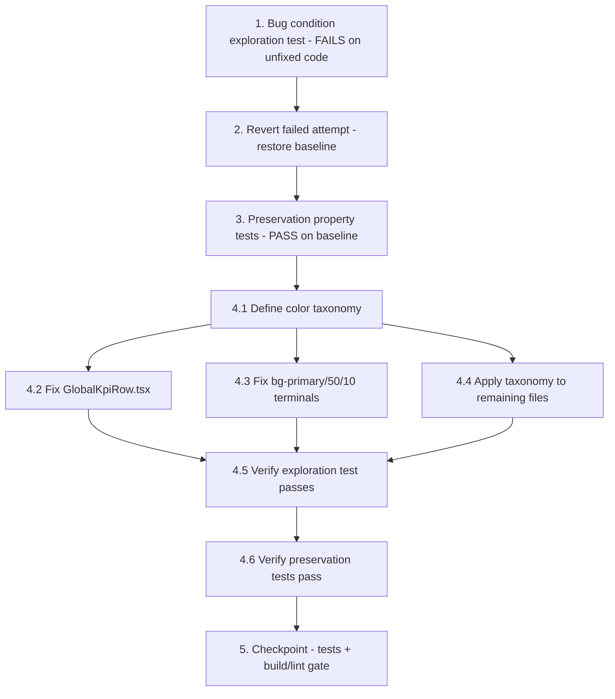

# Implementation Plan

## Overview

This plan fixes the UI theme color inconsistency using the bug condition methodology. It first
surfaces counterexamples that prove the bug exists (Property 1: Bug Condition), reverts the damaging
uncommitted changes from the failed mechanical script to restore a clean baseline, captures the
behavior that must not change (Property 2: Preservation), then applies a documented color taxonomy
per file (semantic vs. categorical tokens) so every color resolves to the global theme. Finally it
re-runs the same exploration and preservation tests and a build/lint gate to confirm the fix works
without regressions.

> **Tooling note:** The frontend uses Vitest + React Testing Library (jsdom). Run tests with
> `npm run test` (`vitest run`), build with `npm run build` (`vite build`), and lint with
> `npm run lint` (`eslint .`). Property-based tests below require a PBT library — add `fast-check`
> as a dev dependency (`npm i -D fast-check`) before writing the property tests. Static scans use
> `grep`/ripgrep over the affected files.

## Tasks

- [x] 1. Write bug condition exploration test (static scans + render checks)
  - **Property 1: Bug Condition** - Colors Specified Outside the Global Theme
  - **CRITICAL**: This test MUST FAIL on the current (failed-attempt) code - failure confirms the bug exists
  - **DO NOT attempt to fix the test or the code when it fails**
  - **NOTE**: This test encodes the expected behavior - it will validate the fix when it passes after implementation
  - **GOAL**: Surface counterexamples that demonstrate the bug and confirm/refute the root cause (no taxonomy, mechanical 1:1 mapping, class-only replacement leaving inline hex, unhandled invalid classes)
  - **Scoped PBT Approach**: Because the symptom is static-class + visual correctness, scope the property to the concrete affected files enumerated in the design's Fix Implementation section, and assert `isBugCondition(element) == false` for every rendered color-bearing element after the fix
  - Implement the four static scans from the design's "Exploratory Bug Condition Checking":
    - Invalid-class scan: grep for malformed double-opacity classes (`bg-primary/50/10`, `bg-muted/40/20`, `bg-secondary/5/50`, `bg-primary/20/20`) — expect matches in `OperationalGateway.tsx`, `SelfServiceKiosk.tsx`, `ShiftCloseTerminal.tsx`, `GlobalKpiRow.tsx`
    - Raw-palette scan: grep for `text-/bg-/border-(red|amber|emerald|green|sky|indigo|blue|rose|violet)-\d` in affected files — expect remaining raw palette classes
    - Inline-hex scan: grep for `style={{ (color|backgroundColor)` with a hex literal — expect `GlobalKpiRow.tsx` (`#10b981`, etc.) and others
    - Lost-distinguishability render test: render `GlobalKpiRow` and assert the set of card accent classes contains the expected number of *distinct* accents — expect duplicates (multiple `bg-primary/20`) on the failed-attempt code
    - Edge case — token/hex mismatch render test: render `GlobalKpiRow` and assert each card's icon color and accent derive from the same token — expect a mismatch where `bg-success/20` pairs with hex `#10b981`
  - The assertions should match the Expected Behavior Properties from design (Property 1): color resolves to a theme token, semantic-iff-status-meaning, categorical token for decorative variety, no token/hex mismatch, valid single-opacity Tailwind, legible in light and dark mode
  - Run the scans/tests on UNFIXED (current failed-attempt) code
  - **EXPECTED OUTCOME**: Test FAILS (this is correct - it proves the bug exists)
  - Document counterexamples found (e.g. "`bg-primary/50/10` present in OperationalGateway.tsx", "two KPI cards share `bg-primary/20`", "`bg-success/20` accent pairs with inline hex `#10b981`") to understand the root cause
  - Mark task complete when the test is written, run, and the failure is documented
  - _Requirements: 1.1, 1.2, 1.3, 1.4, 1.5, 1.6, 1.7, 1.8_

- [ ] 2. Revert the failed attempt to restore the known baseline (precondition)
  - **IMPORTANT**: Per the design's "Step 0 — Revert the failed attempt", this must happen BEFORE preservation observation (task 3) and BEFORE the fix (task 4), so per-file work and preservation baselines start from clean, intentional code
  - **SAFETY**: This is a working-tree revert of uncommitted changes; `git restore` is NOT reversible for un-staged edits. Confirm with the user before discarding the changes
  - Revert each modified tracked file with a targeted `git restore <path>` (or `git checkout -- <path>`), NOT a blanket reset:
    - `src/pages/core/inventory/InventoryAdjustments.tsx`
    - `src/pages/fnb/Cashier.tsx`
    - `src/pages/fnb/Inventory.tsx`
    - `src/pages/industry/farming/FarmDesk.tsx`
    - `src/pages/retail/management/DeveloperConsole.tsx`
    - `src/pages/retail/management/DeviceControlCenter.tsx`
    - `src/pages/retail/management/EcommerceAnalytics.tsx`
    - `src/pages/retail/management/command-center/GlobalKpiRow.tsx`
    - `src/pages/retail/management/command-center/InfrastructureHealth.tsx`
    - `src/pages/retail/operational/OperationalGateway.tsx`
    - `src/pages/retail/operational/RefundReturnDesk.tsx`
    - `src/pages/retail/operational/SelfServiceKiosk.tsx`
    - `src/pages/retail/operational/pos/Cashier.tsx`
  - Quarantine the failed-attempt helper artifacts so they cannot be re-run or relied upon: `scripts/fix-theme-colors.cjs` and any untracked helpers it generated (`docs/THEME_COLOR_GUIDE.md`, `docs/UI_COLOR_FIX_REPORT.md`, `src/lib/theme-colors.ts`, `src/components/ui/status-*.tsx`). Review and remove or rewrite only as part of the intended taxonomy; do not delete files the user wants to keep without confirming
  - Re-establish the baseline: run `npm run build` and `npm run lint` to capture the pre-fix state (including the pre-existing invalid `bg-primary/50/10`) as a clean starting point
  - Mark task complete when the listed files are reverted, helper artifacts are quarantined, and the baseline build/lint state is recorded
  - _Requirements: 1.4_

- [ ] 3. Write preservation property tests on the reverted baseline (BEFORE implementing fix)
  - **Property 2: Preservation** - Already-Correct Elements and Non-Color Styling Unchanged
  - **IMPORTANT**: Follow the observation-first methodology against the REVERTED baseline from task 2
  - Observe behavior on the baseline for non-buggy inputs (where `isBugCondition` returns false) and record actual outputs:
    - Theme-token usages: elements using `text-primary`, `bg-success/10`, `text-muted-foreground`, `border-border`, `bg-card` render correctly
    - Correct-semantic usages: a true error in `text-destructive` and a true success badge in `text-success`
    - Chart series already consuming `chart-1..5`
    - Non-color styling: layout, spacing, typography, opacity intent (`/10`, `/20`, `/30`), glassmorphism (`glass-card`, `backdrop-blur-*`), animations, transitions, glows, shadows
  - Write property-based tests (using `fast-check`) capturing the observed behavior patterns from the design's Preservation Requirements:
    - Generate random valid theme-token + single-opacity combinations and assert the fix leaves them unchanged
    - Generate random non-color style props and assert the fix never alters non-color styling
  - Add unit/render fixtures asserting `render_original(element) == render_fixed(element)` for the captured baseline elements
  - Run the tests on the reverted baseline (the "unfixed" reference state)
  - **EXPECTED OUTCOME**: Tests PASS (this confirms the baseline behavior to preserve)
  - Mark task complete when the tests are written, run, and passing on the reverted baseline
  - _Requirements: 3.1, 3.2, 3.3, 3.4, 3.5, 3.6_

- [ ] 4. Fix for UI theme color inconsistency (apply the color taxonomy per file)

  - [ ] 4.1 Define and document the color taxonomy
    - Document the decision rules that replace the mechanical mapping: **semantic** color (status meaning) → semantic token (`success`, `destructive`, `warning`, `info`, `primary`); **categorical/decorative** color (variety only) → categorical token (`chart-1..5`, cycling deterministically by index)
    - Document the token/hex pairing rule (accent class and icon/graphic color come from the same token; inline hex replaced with a matching Tailwind class or `hsl(var(--token))`) and the opacity-validity rule (single opacity suffix only)
    - Confirm all referenced tokens exist in `src/index.css` for both `:root` (light) and `.dark`
    - _Bug_Condition: isBugCondition(element) from design (raw palette / inline hex / wrong semantic collapse / token-hex mismatch / invalid class)_
    - _Expected_Behavior: expectedBehavior(result) — color resolves to correct theme token; semantic iff status meaning; categorical for decorative variety_
    - _Requirements: 2.1, 2.3, 2.5, 2.7_

  - [ ] 4.2 Fix the representative file `GlobalKpiRow.tsx`
    - Reclassify the KPI accents as categorical: assign each card a distinct `chart-1..5` token (cycling) so cards stay distinguishable; keep a semantic token (`destructive`) only where the card genuinely conveys status (e.g. "System Alerts")
    - Remove the inline hex `color`/`item.color`: source the icon color from the same token as the card accent (Tailwind class or `hsl(var(--chart-n))`), and remove the sparkline `stroke`/`fill` hex
    - Fix the invalid class `bg-muted/40/20` ("Avg Ticket" card) to a valid single-opacity utility
    - Preserve all non-color styling: layout grid, glassmorphism (`bg-white/[0.03]`, `backdrop-blur-3xl`), the `LIVE` badge semantics, animations, sizing, opacity intent
    - _Bug_Condition: isBugCondition(element) where element uses inline hex, collapsed/duplicate accent, or invalid class_
    - _Expected_Behavior: each card a distinct categorical token; icon and accent share the same token; valid single-opacity utilities_
    - _Preservation: non-color styling and LIVE badge unchanged (Preservation Requirements from design)_
    - _Requirements: 2.1, 2.2, 2.5, 2.6, 2.7, 2.9_

  - [ ] 4.3 Fix invalid `bg-primary/50/10` in operational terminals
    - Replace `bg-primary/50/10` with a valid single-opacity utility (`bg-primary/10` or the intended value) in `OperationalGateway.tsx`, `SelfServiceKiosk.tsx`, and `ShiftCloseTerminal.tsx`
    - Keep the genuinely semantic `color`/`bg` pairs (`text-destructive`/`bg-destructive/10`, `text-warning`/`bg-warning/10`) as-is
    - _Bug_Condition: isBugCondition(element) where element has an invalid/malformed Tailwind color class_
    - _Expected_Behavior: valid single-opacity utility that resolves correctly_
    - _Preservation: genuinely semantic color pairs unchanged_
    - _Requirements: 2.4, 2.9_

  - [ ] 4.4 Apply the taxonomy to remaining affected files (context-aware, per file)
    - For each of `InventoryAdjustments.tsx`, `fnb/Cashier.tsx`, `fnb/Inventory.tsx`, `FarmDesk.tsx`, `DeveloperConsole.tsx`, `DeviceControlCenter.tsx`, `EcommerceAnalytics.tsx`, `InfrastructureHealth.tsx`, `RefundReturnDesk.tsx`, `pos/Cashier.tsx`: reclassify each raw palette class / inline hex as semantic or categorical and apply the matching token; fix any malformed opacity classes found
    - Run a wider sweep for malformed double-opacity classes (`bg-secondary/5/50`, `bg-primary/20/20`, `bg-success/10/50`, etc.) across `store-profile` and POS modules and correct them to valid single-opacity utilities
    - Ensure the same conceptual status maps to the same semantic token across pages, and multi-item groups assign distinct categorical tokens
    - **NEVER use a blanket find-and-replace script** — apply the taxonomy per file, context-aware
    - _Bug_Condition: isBugCondition(element) from design across the affected files_
    - _Expected_Behavior: color resolves to the correct theme token; semantic iff status; categorical for variety; no token/hex mismatch; valid Tailwind; legible in light and dark mode_
    - _Preservation: already-correct elements and non-color styling untouched_
    - _Requirements: 2.1, 2.2, 2.3, 2.6, 2.7, 2.8, 2.9_

  - [ ] 4.5 Verify bug condition exploration test now passes
    - **Property 1: Expected Behavior** - Colors Resolve to the Correct Theme Token
    - **IMPORTANT**: Re-run the SAME scans/tests from task 1 - do NOT write new tests
    - The test from task 1 encodes the expected behavior; when it passes it confirms the expected behavior is satisfied
    - Run the static scans and render checks from task 1 against the fixed code
    - **EXPECTED OUTCOME**: Test PASSES (no raw palette classes, no inline hex mismatches, no invalid/malformed classes, distinct categorical accents, icon/accent share token, legible in both modes)
    - _Requirements: 2.1, 2.2, 2.3, 2.4, 2.5, 2.6, 2.7, 2.8, 2.9_

  - [ ] 4.6 Verify preservation tests still pass
    - **Property 2: Preservation** - Already-Correct Elements and Non-Color Styling Unchanged
    - **IMPORTANT**: Re-run the SAME tests from task 3 - do NOT write new tests
    - Run the preservation property tests and fixtures from task 3 against the fixed code
    - **EXPECTED OUTCOME**: Tests PASS (confirms no regressions — theme-token usages, correct semantic badges, `chart-1..5` charts, and all non-color styling unchanged)
    - Confirm all tests still pass after the fix (no regressions)
    - _Requirements: 3.1, 3.2, 3.3, 3.4, 3.5, 3.6_

- [ ] 5. Checkpoint - Ensure all tests pass and the build/lint gate is green
  - Run `npm run test` (`vitest run`) and confirm both the bug condition exploration test (task 1) and the preservation tests (task 3) pass
  - Run `npm run build` (`vite build`) and `npm run lint` (`eslint .`) and assert no invalid/malformed Tailwind color classes and no errors are reported (the build/lint gate for Requirement 2.9)
  - Toggle the `.dark` class on the document root for representative pages (command center with `GlobalKpiRow`, `OperationalGateway`, `SelfServiceKiosk`, `ShiftCloseTerminal`) and verify legible, theme-consistent colors in both modes
  - Ensure all tests pass; ask the user if questions arise
  - _Requirements: 2.1, 2.2, 2.3, 2.4, 2.5, 2.6, 2.7, 2.8, 2.9, 3.1, 3.2, 3.3, 3.4, 3.5, 3.6_

## Task Dependency Graph



```json
{
  "waves": [
    { "wave": 1, "tasks": ["1"] },
    { "wave": 2, "tasks": ["2"] },
    { "wave": 3, "tasks": ["3"] },
    { "wave": 4, "tasks": ["4.1"] },
    { "wave": 5, "tasks": ["4.2", "4.3", "4.4"] },
    { "wave": 6, "tasks": ["4.5"] },
    { "wave": 7, "tasks": ["4.6"] },
    { "wave": 8, "tasks": ["5"] }
  ]
}
```

## Notes

- **Methodology:** This is a bugfix spec following the bug condition methodology. Property 1 (Bug
  Condition / Expected Behavior) and Property 2 (Preservation) are the two correctness properties
  from `design.md`. Tasks 1 and 3 are property-based tests written BEFORE the fix; tasks 4.5 and 4.6
  re-run those exact tests after the fix.
- **Ordering is critical:** Task 1 must FAIL on the current code (proving the bug). Task 2 reverts the
  failed attempt so the preservation baseline (task 3) and fix (task 4) start clean. Task 3 must PASS
  on the reverted baseline before any fix is applied.
- **Do not use a blanket script:** The previous failure came from `scripts/fix-theme-colors.cjs`
  running a mechanical 1:1 mapping. The fix must be applied per file, context-aware, using the
  documented color taxonomy (semantic vs. categorical tokens).
- **Safety:** Task 2 uses `git restore` on uncommitted working-tree changes, which is not reversible.
  Confirm with the user before discarding, and do not delete helper artifacts the user wants to keep.
- **PBT dependency:** No property-based testing library is currently installed. Add `fast-check`
  (`npm i -D fast-check`) before writing the property tests in tasks 1 and 3.
- **Build/lint gate:** Requirement 2.9 is verified by a clean `npm run build` and `npm run lint` with
  no invalid/malformed Tailwind color classes remaining.
