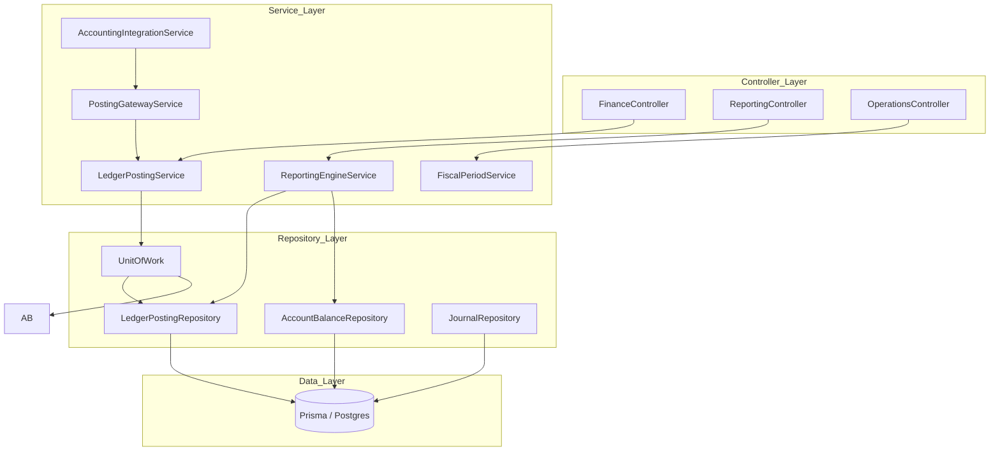

# 01_architecture/dependency_graph.md

## Dependency Graph: Finance Core

### Analysis of Boundaries
1. **Vertical Flow**: Strictly follows Controller -> Service -> Repository -> DB.
2. **Circular Dependencies**: None detected in the `FinanceModule` setup.
3. **Cross-Service Coupling**: `LedgerPostingService` is the central hub. Most other services depend on it for data entry, ensuring centralized validation.
