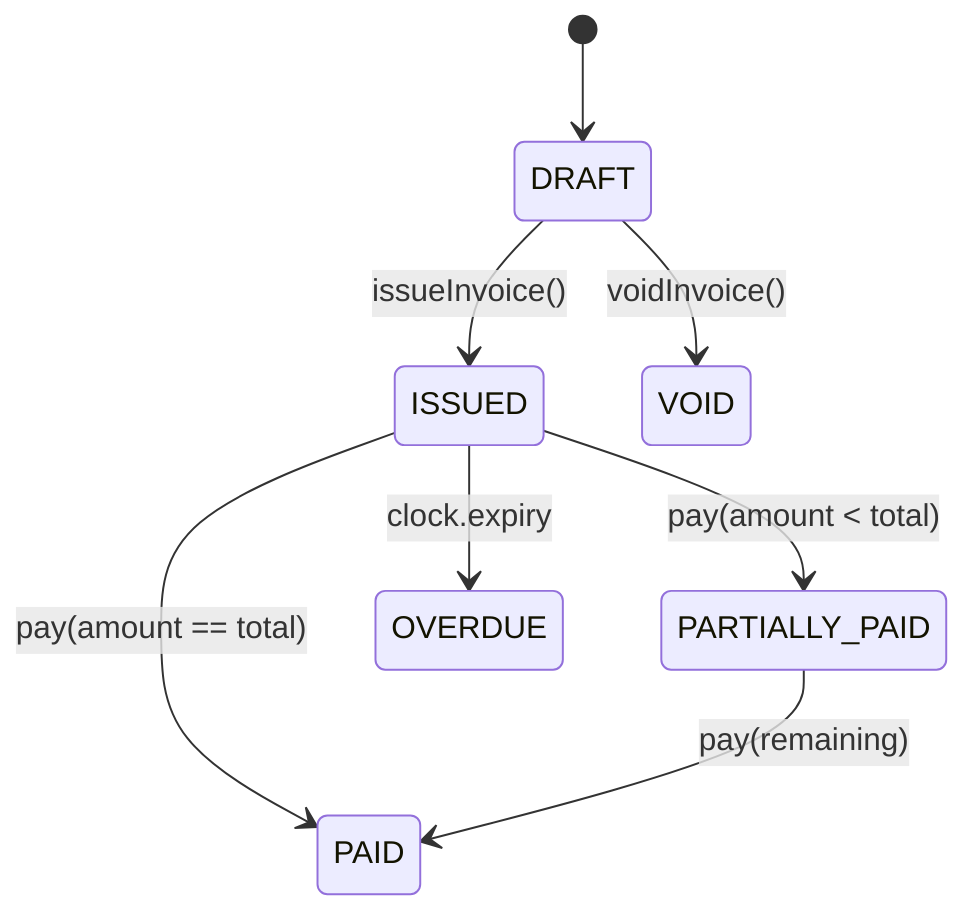

# State Transitions: AR Lifecycle

## 1. Invoice Lifecycle
The `ArInvoice` state machine controls the billing process.

## 2. Critical Constraints
- **Issuance Lock**: Moving from `DRAFT` to `ISSUED` triggers the `AR_INVOICE_ISSUED` ledger event. Once issued, the invoice base total is locked.
- **Void Barrier**: The `voidInvoice()` method explicitly blocks transitions if the status is `ISSUED` or `PAID`. This forces users to use the Reversal/Credit Memo flow for issued documents.
- **Credit Limits**: `PARTIALLY_PAID` status still consumes the customer's `creditLimit` until full settlement.

## 3. Customer Financial Status
- `ACTIVE`: Standard operations.
- `BLOCKED`: Prevent creation of new `DRAFT` invoices.
- `INACTIVE`: Soft-deleted, hidden from selection.
