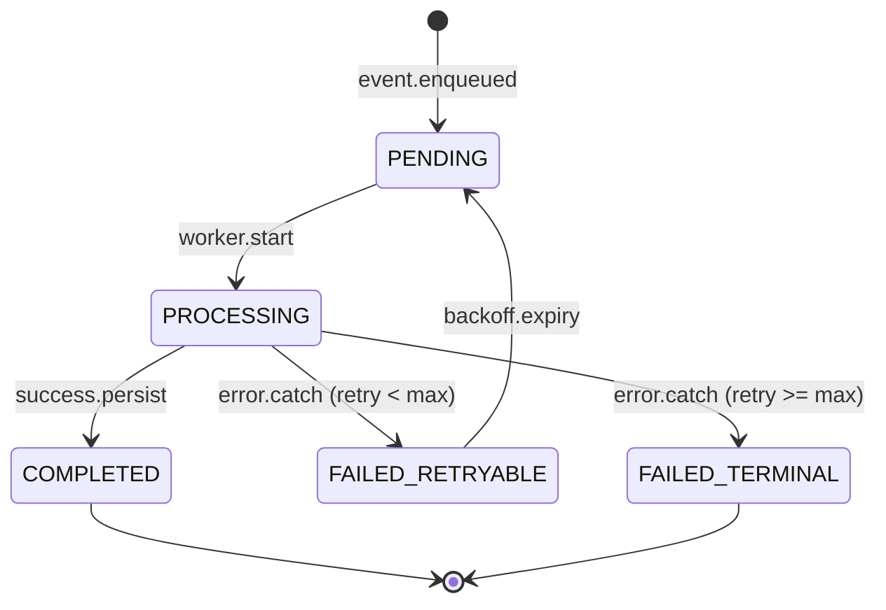

# State Transitions: Ledger & Journals

## 1. Ledger Posting Lifecycle
The `LedgerPosting` entity tracks the background processing of financial events.

## 2. Journal Entry States
Journal entries represent the final source of truth in the General Ledger.

| State | Description | Transition Rule |
| --- | --- | --- |
| `DRAFT` | Temporary storage. | In-memory only during rule evaluation. |
| `VALIDATED`| Passed structural checks. | Before crypto-hashing. |
| `POSTED` | Persisted and Hashed. | Immutable. Cannot be modified or deleted. |
| `REVERSED` | Negated by another entry. | Result of a `POST /reverse-journal` call. |

## 3. Immutability Enforcement
- Once a journal reaches `POSTED`, any change to its lines or header is blocked by the Ledger Engine.
- Corrections MUST be made via a new `JournalType.REVERSAL` or `ADJUSTMENT` entry to maintain a clean audit trail.
