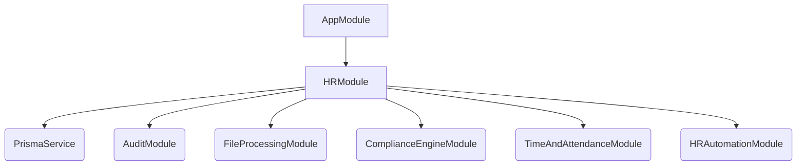
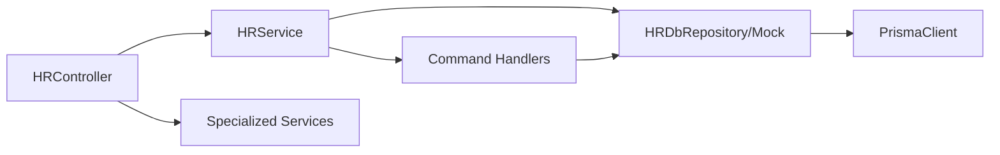

# HR Dependency Graph

## Top-Level Dependencies (NestJS)

## Internal Call Graph (High Level)

## Data Dependencies (Prisma)
- **Employee** depends on **Company** (Tenant)
- **Employee** depends on **Location** (Branch)
- **Employee** depends on **Department**
- **Payroll** depends on **Employee**
- **TrainingAssignment** depends on **TrainingProgram** and **Employee**
- **Store** (Retail) depends on **Employee** (as Manager)
