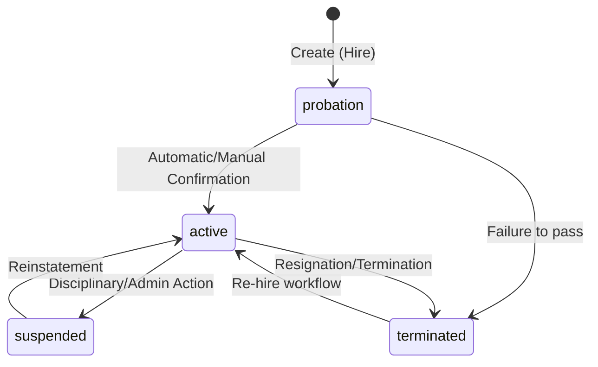
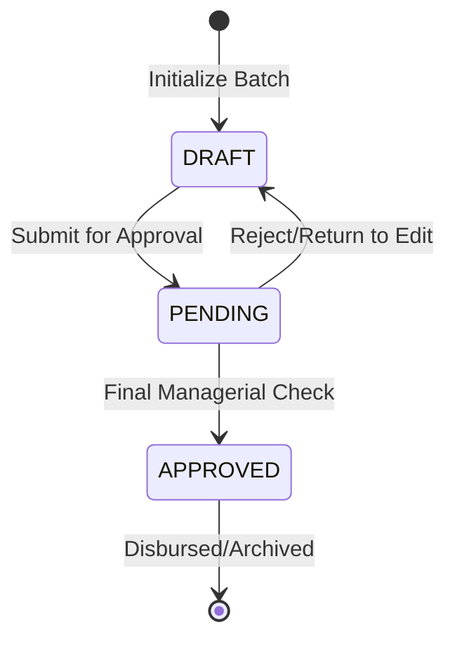
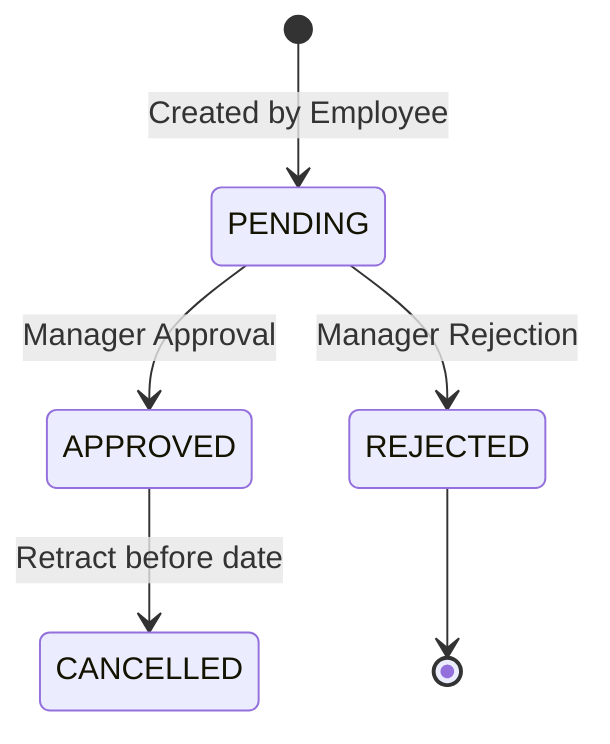

# HR State Machine

## 1. Employee Lifecycle
The primary state machine for human capital records.

## 2. Payroll Run Status
Tracks the state of a financial payout batch.

## 3. Leave Request Status

