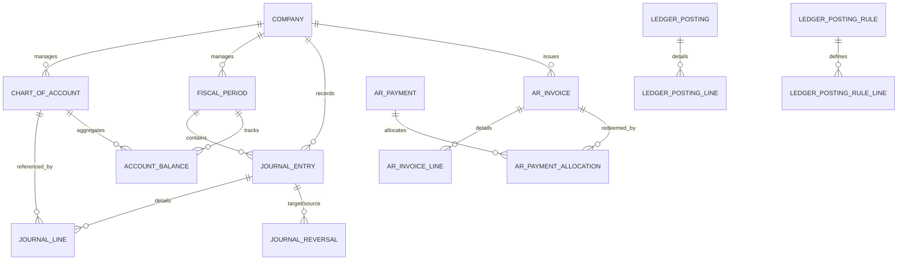

# Finance Entity Relationships

## Relationship Integrity Audit

| Relationship | Constraint | Audit Verdict |
|--------------|------------|---------------|
| `COA -> JournalLine` | Mandatory | **PASSED** |
| `FiscalPeriod -> JournalEntry` | Mandatory | **PASSED** |
| `JournalEntry -> JournalLine` | Balanced | **AUDIT_REQUIRED** (Ensured at Logic Layer) |
| `ArPayment -> ArInvoice` | Allocations | **PASSED** |
