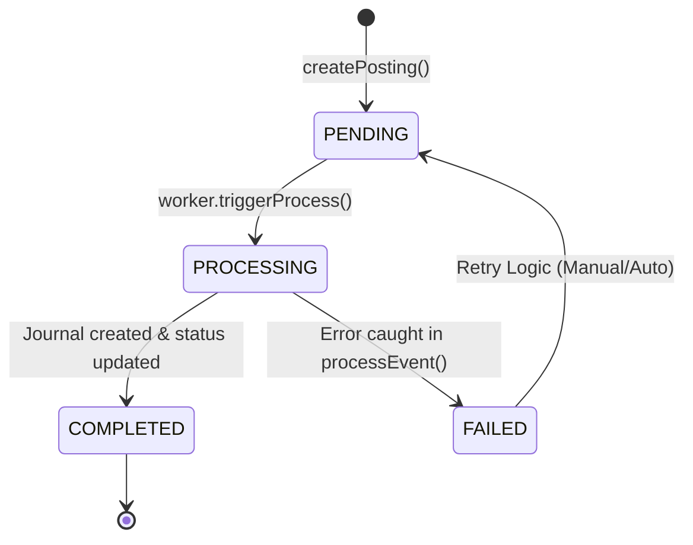
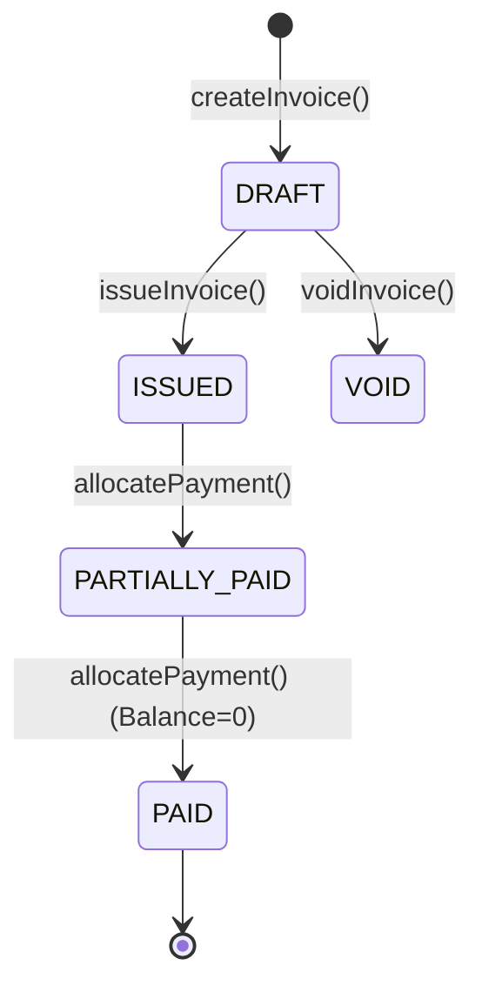

# Finance State Machine Audit

## 1. Ledger Posting Lifecycle
The `LedgerPosting` entity follows a linear state progression:

| State | transitions to | Condition |
|-------|----------------|-----------|
| **PENDING** | `PROCESSING` | Worker selects the record for execution |
| **PROCESSING** | `COMPLETED` | Successful commit of JournalEntry & Lines |
| **PROCESSING** | `FAILED` | Exception (Rule not found, Unbalanced, Locked Period) |

## 2. AR Invoice Lifecycle

## 3. Critical State Guardrails
- **Immutable VOID**: Invoices in `ISSUED` or `PAID` status cannot be `VOID`ed; they must be reversed via Journal Entry to preserve the audit trail.
- **Lock Enforcement**: No state can transition from `PENDING` to `COMPLETED` if the target `FiscalPeriod` is `HARD_LOCKED`.
